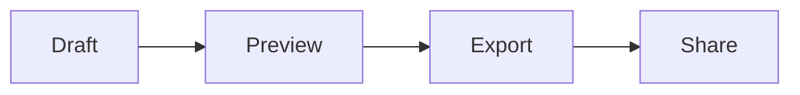

# Markdown Quick Start for VeloWrite

Markdown is a lightweight writing format. You type plain text with a few simple symbols, and VeloWrite turns it into a clean preview that is easy to read, export, and share.

This guide is for people who want to write notes, technical documents, README files, product specs, blog drafts, meeting notes, or learning material without fighting a heavy word processor.

## Why Use Markdown

Markdown works well because the source text stays readable. Your document is not locked inside one editor, and the same file can be opened by VeloWrite, GitHub, documentation tools, static site generators, and many developer workflows.

Use Markdown when you want:

- Fast writing with very little formatting overhead
- Notes that are easy to keep in Git or local folders
- Technical documents with code blocks, tables, links, and math
- Exports to HTML or other publishing formats
- Files that stay portable for years

VeloWrite is built around this workflow: start quickly in the browser, then use the desktop app when you need direct local file access, offline writing, recent files, and local history snapshots.

## Basic Structure

Use headings to organize your document.

```markdown
# Project Plan

## Goals

## Timeline

### Week 1
```

VeloWrite uses headings to build the document outline. Click a heading in the outline to jump through both the rendered preview and the Markdown editor.

## Paragraphs And Emphasis

Write normal paragraphs as plain text. Leave a blank line between paragraphs.

```markdown
This is the first paragraph.

This is the second paragraph.
```

Use emphasis when needed.

```markdown
This is **bold**.
This is *italic*.
This is `inline code`.
```

Keep formatting intentional. Markdown is strongest when the document stays readable even before rendering.

## Lists

Use bullets for unordered ideas.

```markdown
- Draft the outline
- Review the examples
- Export the final document
```

Use numbers for steps.

```markdown
1. Open VeloWrite.
2. Create or open a Markdown file.
3. Write in split mode.
4. Export or save when finished.
```

Use task lists for progress tracking.

```markdown
- [x] Write the draft
- [x] Review the preview
- [ ] Publish the final version
```

## Links And Images

Links use square brackets for the label and parentheses for the destination.

```markdown
[Visit VeloWrite](https://velowrite.app)
```

Images use the same pattern with an exclamation mark.

```markdown

```

For local image-heavy workflows, the desktop app is a better long-term fit because browsers are limited by sandbox rules.

## Tables

Tables are useful for comparison and planning.

```markdown
| Task | Web Editor | Desktop App |
| --- | --- | --- |
| Quick draft | Excellent | Good |
| Direct local save | Browser download | Native save |
| Offline work | Limited | Strong |
| History snapshots | Browser draft only | Local snapshots |
```

VeloWrite renders tables in the preview so you can keep the source simple and still present the result clearly.

## Code Blocks

Use fenced code blocks for technical notes.

````markdown
```python
def greet(name):
    return f"Hello, {name}"
```
````

Add the language name after the opening fence to enable syntax highlighting.

VeloWrite supports highlighted code previews for common languages such as JavaScript, TypeScript, Python, Bash, and Java. Consecutive Python, Bash, Java, and JavaScript examples can be displayed as tabbed code previews, which is useful for documentation that compares the same idea across languages.

## Math

Use inline math inside a paragraph:

```markdown
Energy can be written as $E = mc^2$.
```

Use block math for larger equations:

```markdown
$$
\int_0^\infty e^{-x^2}\,dx = \frac{\sqrt{\pi}}{2}
$$
```

VeloWrite renders math with KaTeX, which makes it useful for engineering notes, learning material, and technical writing.

## Diagrams

You can write Mermaid diagram code blocks as Markdown source.

````markdown

````

Mermaid rendering is on the roadmap. For now, VeloWrite keeps Mermaid blocks readable as code, so the document remains portable.

## A Practical Writing Workflow

1. Start in the VeloWrite web editor when you want to draft immediately.
2. Use split mode to write on the left and preview on the right.
3. Use the outline to jump between sections.
4. Export HTML when you need a clean rendered document.
5. Download the desktop app when the document becomes important enough to keep in a local folder.
6. Use desktop save and local history snapshots for serious writing.

This is the reason VeloWrite provides both a web editor and a desktop app. The web editor lowers friction. The desktop app is for privacy, local files, offline work, and recoverable writing.

## Recommended VeloWrite Features

Use these features first:

- **Split mode** for writing and previewing at the same time
- **Preview mode** for reading the final rendered document
- **Outline navigation** for long documents
- **HTML export** for sharing polished output
- **Desktop save** for direct local file workflows
- **Local history snapshots** for safer editing

If you write Markdown every day, the desktop app is the better default. It keeps your documents on your own machine and avoids browser file-system limitations.

## Starter Template

Copy this structure for your next document:

```markdown
# Document Title

## Summary

Write the short version first.

## Background

Explain why this document exists.

## Details

Add lists, tables, code, links, and math as needed.

## Next Steps

- [ ] First action
- [ ] Second action
- [ ] Third action
```

## Try VeloWrite

Use the online editor when you want to try Markdown immediately:

https://velowrite.app/web

Download the desktop preview when you need native local files, offline writing, recent documents, and recoverable history:

https://velowrite.app/download
